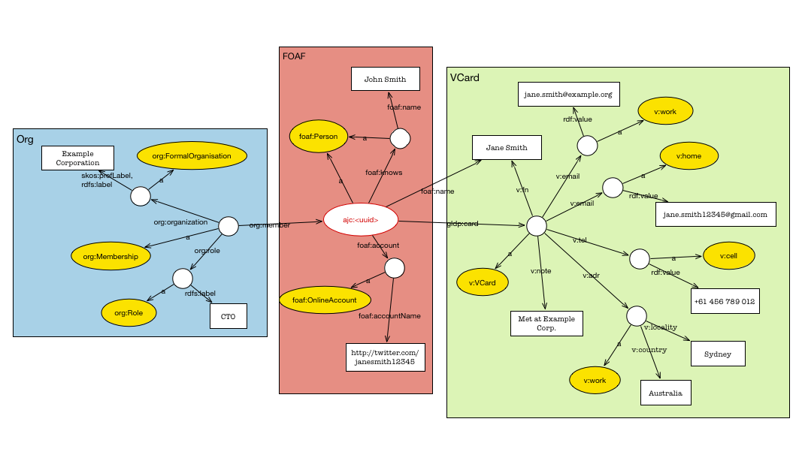
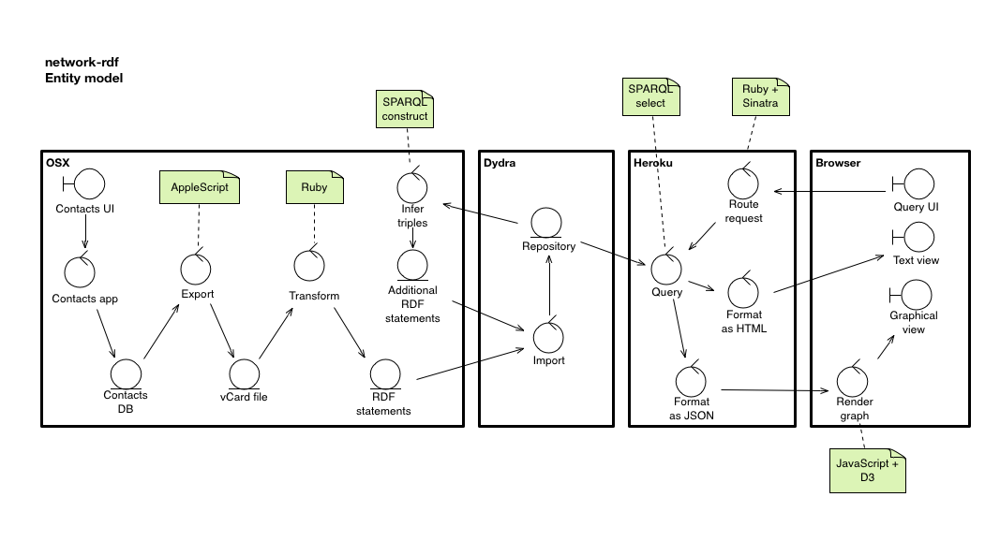

# network-rdf

Adventures in RDF, cloud, and social connections with Ruby.

# Discussion

A discussion of the work to date is covered in the blog post [Semantic Scratchings][blog1]. It basically converts your annotated contacts into RDF, uploads them to a triple store, and implements a simple web UI to query and view the data via SPARQL, and including a couple of simple visualisations via D3.js.

The graph of an example contact in the store looks like the image below. There will often be additional custom RDF annotations or relationships added by the user.

The end-to-end process for delivering information to the user is shown in the following model. The raw contacts data traverses a number of steps and formats on its journey to the browser, but the process is well decoupled through standard interfaces and formats.

Note that the LinkedIn functionality is not complete. Some of the issues are:

* There is a limit on the number of API calls that can be made per month. This makes it difficult to keep information up to date.
* There is no SPARQL API that can be used in a federated query. 

You'll also need to run `src/linkedin/authorise.rb` as a one-off monthly task to get your access token. The code should be reasonably straightforward. Your API token should be stored in `src/config.yaml`.

[blog1]: http://alphajuliet.posterous.com/semantic-scratchings

# Requirements

The following requirements must be met:

* OSX (I'm on 10.8 but earlier versions may work) 
* Your address book is stored in the Contacts app. I use annotations to store additional RDF information, generally as relationships, e.g. `spouse | John Smith`, `foaf:knows | Alice Jones`, and `net:workedAt | Example Corporation`
* Ruby 1.9.3 (1.9.2 may also work, I haven't tried)
* An account on Dydra. Or you'll need to set up the API to talk to another triple store accessible via SPARQL endpoint and a web-services API. This can of course be local.

You may also want to:

* Use rvm to manage Ruby versions and gemsets.
* Use an alternative triple store that has a up-to-date SPARQL interface. You're on your own here.

# Setup

## Config

Add a file called `config.yaml` in `src/` with the following entries, replacing _xxx_, _username_ and so on with your data.

	dydra-token: _xxx_
	dydra-repo: _yyy_
	sparql-endpoint: http://_xxx_@api.dydra.com/_username_/network-rdf/sparql
	rest-endpoint: http://_xxx_@api.dydra.com/_username_/network-rdf
	repo-endpoint: http://_xxx_@api.dydra.com/_username_/network-rdf/statements
	graph-uri: http://_your-path_/network-rdf

## Install and run

* `$ bundle install`
* `$ rvm use 1.9.3`
* Update `config.yaml` with your entries. The key one is the SPARQL endpoint.
* `$ bundle exec rake` to run the unit tests
* `$ bundle exec rake contacts:export` to extract the data from your address book into a vCard file
* `$ bundle exec rake contacts:turtle` to transform the data into RDF/Turtle 
* Import the triples in (`data/contacts-<date>.ttl`) into Dydra or your triple store
* `$ bundle exec rake contacts:infer` to create the inferred triples
* Import the inferred triples in (`data/inferred-<date>.ttl`) into Dydra
* `$ export PORT=4567` to define the IP port for the web server (can be any number)
* `$ bundle exec rake web:start` to run the Sinatra web server
* Go to `http://localhost:4567` to see the start page. Do stuff.

# Vocabularies

I use a set of RDF prefixes defined in `my_prefixes.rb`. You might want to change these. All the vocabularies are well-known, with a couple of additions below.

* __net:__ (mapped to `http://alphajuliet.com/ns/ont/network#`) This is for relationships that are not captured elsewhere, such as in the `REL` or `ORG` vocabularies. The main properties in use are `net:workedAt` which maps from a `foaf:Person` to a `org:Organization`, and `net:preferredHotDrink` (see below).
* __drink:__ (mapped to `http://alphajuliet.com/ns/ont/drink#`) This is for capturing a selection of hot drinks, particularly Australian regional ones. The classes are used as the range for the `net:preferredHotDrink` and `net:drinks` properties. This is still undergoing some change.

# Issues

## Relationships

The mapping problem for relationships is twofold:

1. There are groups
2. There is custom and inconsistent tagging of entries

Examples and desired output (assuming my standard prefixes):

	URL;type=WORK;type=pref:http://www.example.org/
	--> ajc:person-xxxx foaf:page <http://www.example.org/> .

	The above result is because we cannot detect type=WORK from the vCard gem.
	
	URL;type=HOME;type=pref:http://www.example.org/
	--> ajc:person-xxxx foaf:homepage <http://www.example.org/> .

	item1.URL:http://jane.smith.name/
	item1.X-ABLabel:_$!<HomePage>!$_
	--> ajc:person-xxxx foaf:homePage <http://jane.smith.name/>
	
	item2.URL:http://www.example.org/janesmith/profile
	item2.X-ABLabel:profile
	--> ajc:person-xxxx rdfs:seeAlso <http://www.example.org/janesmith/profile>

	item3.X-ABRELATEDNAMES;type=pref:John Smith
	item3.X-ABLabel:_$!<Spouse>!$_
	--> ajc:person-xxxx foaf:knows [ a foaf:Person ; foaf:name "John Smith" ] .
	
	item5.X-ABRELATEDNAMES:Oracle Australia
	item5.X-ABLabel:net:workedAt
	--> ajc:person-xxxx net:workedAt [ a org:Organization ; skos:prefLabel "Oracle Australia" ] .
	
	item7.X-ABRELATEDNAMES:Alice Jones
	item7.X-ABLabel:foaf:knows
	--> ajc:person-xxxx foaf:knows [ a foaf:Person ; foaf:name "Alice Jones" ] .

The current solution satisfies most of these, but the implementation is not as clean as I would like.
